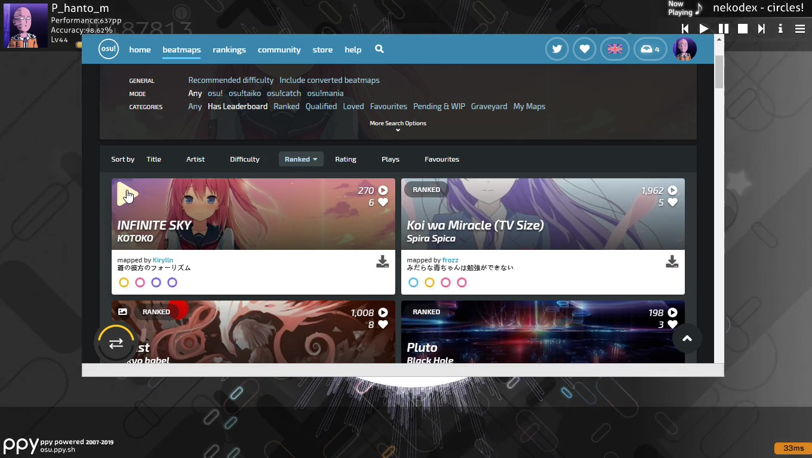

# OsuWebDirect
Ingame web browser overlay for downloading osu beatmaps (like osu!direct)

## See it in action
#### **Video https://youtu.be/M4qMBID1mpE**

## Prerequisites
* .NET Framework 4.7 or higher version
* Set X86 mode in visual studio

## Download

You can download latest release from [Releases](https://github.com/Fantoom/OsuWebDirect/releases "Releases") page

## Installing

Just download and unzip the folder anywhere you want

## Instructions

Open osu. open OsuWebDirect and press the hotkey (F11 is default).

If you want to change program settings. open "settings.json" file from program folder

## Changelog

>### [[0.0.1]](https://github.com/Fantoom/OsuWebDirect/releases/tag/v0.0.1b) - 2019-11-13
>#### First Upload

## Built With

* [CefSharp](https://github.com/cefsharp/CefSharp) - Chromium Embedded Framework

## Contributing

Contributions are always welcome!
Please read the [Contribution guidelines](https://github.com/Fantoom/OsuWebDirect/blob/master/Contributing.md) first.

## License

This project is licensed under the MIT License - see the [LICENSE.md](LICENSE.md) file for details

